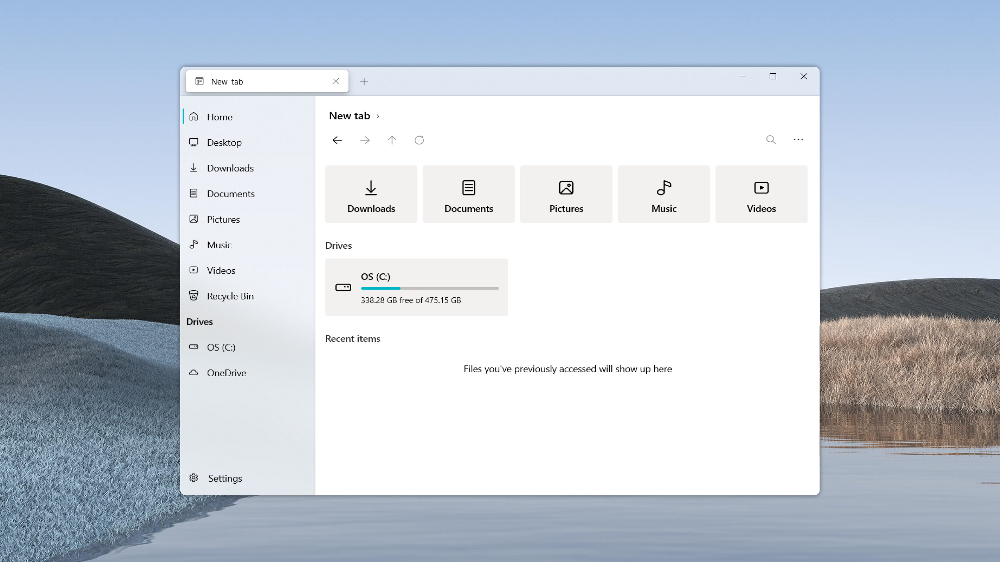

## Files
Meet Files, an enthusiast take on what a modern file explorer should be.

Files [code of conduct](https://github.com/files-community/files-uwp/blob/master/CODE_OF_CONDUCT.md)

## Download Files 
- [Microsoft Store](https://www.microsoft.com/store/apps/9NGHP3DX8HDX)
- [GitHub](https://github.com/files-community/Files/releases)

## What is Files?
Files is a file manager which leverages the latest features of the Windows platform including Fluent Design, seamless updates, and APIs which enable the performance and lifecycle behavior that users expect. Whether you want to simplify your experience with your files or try something new, Files is a one-stop solution for exploring your files on the fly.

## Why should I contribute?
We can confidently assert Files is the platform's best file explorer project to bring your innovations to. We focus heavily on extensibility and code modularity and have no plans to stop doing so. When you contribute to this project, you're helping everyone by fixing reported bugs, adding new features, or correcting existing behavior. These changes are quickly included in the final product for all users to benefit from.

## Vision for Files
The vision for Files is to make it the best file manager while keeping it simple and easy to use. Whether it's implementing new features, or pushing the boundaries of the platform, your input will help shape the future of Files.

## Building Files source
- Install Visual Studio 2019 and the UWP Development Kit.
- Clone the repository and open the `Files.sln` in VS.
- Visual Studio will install all missing dependencies.
- Run the `Files.Package` project.

## FAQ
Have any questions? Check out our documentation [site](https://files-community.github.io/docs/#/)!
